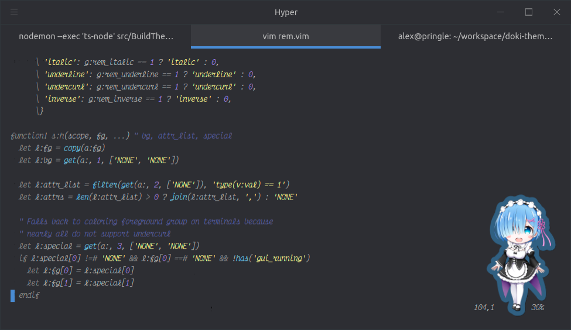

Doki Theme VIM
---



These VIM color themes will complement your [Doki Theme for Hyper themes](https://github.com/doki-theme/doki-theme-hyper) very well.
Go for the full Otaku terminal experience!


## Installation

These are the default instructions using Vim 8's `|packages|` feature. See
sections below, if you use other plugin managers.

1. Create theme folder (in case you don't have yet):

```
mkdir -p ~/.vim/pack/themes/start
```

If you use vim 8.0 (and not 8.2), you may need to use
`~/.vim/pack/themes/opt` instead.

2. Navigate to the folder above:

```
cd ~/.vim/pack/themes/start
```

3. Clone the repository using the "doki-theme" name:

```
git clone https://github.com/doki-theme/doki-theme-vim.git doki-theme
```

4. Create configuration file (in case you don't have yet):

```
touch ~/.vimrc
```

5. Edit the `~/.vimrc` file with the following content:
```
packadd! doki-theme
syntax enable
colorscheme rem
```

6. Now in VIM, you can find a full list of all the Doki Theme `colorschemes` by following these steps:
    1. Open VIM
    1. type `:colorscheme` then add a `space` followed by a `ctrl+d`
    


### Acknowledgments

Big thanks to the [Vim for Darcula](https://github.com/darcula/vim.git) for being the base for this plugin!

---

<div align="center">
    </img>
</div>


