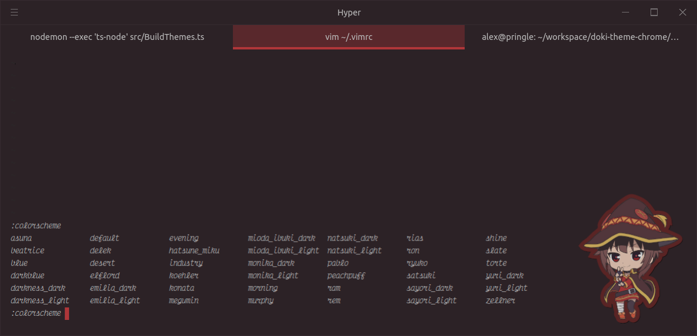

Doki Theme VIM
---


These VIM color themes will complement your [Doki Theme for Hyper themes](https://github.com/doki-theme/doki-theme-hyper) very well.
Go for the full Otaku terminal experience!

## Contents

- [Installation](#installation)
- [Supported Plugins](#supported-plugins)

## Installation

- [Vim](#vim)
- [NeoVim](#neovim)

### Vim

These are the default instructions using Vim 8's `|packages|` feature. See
sections below, if you use other plugin managers.

1. Create theme folder (in case you don't have yet):

```shell
mkdir -p ~/.vim/pack/themes/start
```

If you use vim 8.0 (and not 8.2), you may need to use
`~/.vim/pack/themes/opt` instead.

2. Navigate to the folder above:

```shell
cd ~/.vim/pack/themes/start
```

3. Clone the repository using the "doki-theme" name:

```shell
git clone https://github.com/doki-theme/doki-theme-vim.git doki-theme
```

4. Create configuration file (in case you don't have yet):

```shell
touch ~/.vimrc
```

5. Edit the `~/.vimrc` file with the following content:
```shell
packadd! doki-theme
syntax enable
colorscheme rem
```

6. Now in VIM, you can find a full list of all the Doki Theme `colorschemes` by following these steps:
    1. Open VIM
    1. type `:colorscheme` then add a `space` followed by a `ctrl+d`
    

### NeoVim

These are the default instructions using NeoVim's `|packages|` feature. See
sections below, if you use other plugin managers.

1. Create theme folder (in case you don't have yet):

```shell
mkdir -p ~/.local/share/nvim/site/pack/themes/start
```

2. Navigate to the folder above:

```shell
cd  ~/.local/share/nvim/site/pack/themes/start
```

3. Clone the repository using the "doki-theme" name:

```shell
git clone https://github.com/doki-theme/doki-theme-vim.git doki-theme
```

4. Create configuration file (in case you don't have yet):

```
touch ~/.config/nvim/init.vim
```

5. Edit the `~/.vimrc` file with the following content:
```
packadd! doki-theme
syntax enable
colorscheme zero_two_dark
```

6. Now in NeoVim, you can find a full list of all the Doki Theme `colorschemes` by following these steps:
    1. Open NeoVim
    1. type `:colorscheme` then add a `space` followed by a `ctrl+d`
    

## Supported Plugins


## Contributing

If you want to get your workstation set up to work on the plugin,
then you'll want to check out the [CONTRIBUTING.md](./CONTRIBUTING.md) for instructions on what is needed.


---

<div align="center">
    </img>
</div>


